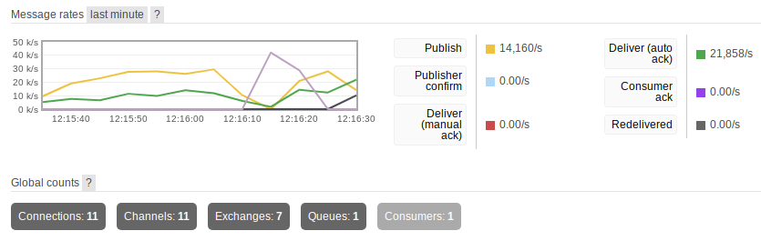

# RabbitMQ test (2022)

A tiny informal experiment I did to check how many random paragraphs I could send through RabbitMQ
without much effort.

**Do not view current results as a reliable data.**
My goal was to see how many messages pass with default options and I did not tinker with config,
and the [testing conditions are currently wrong](https://github.com/mosquito/aio-pika/issues/460#issuecomment-1108919519).
At the very least, it was a good starting point for tinkering.
I will need to either enable publisher confirmations or turn of confirmations in `pika`.

## Current results

Hardware: AMD Ryzen 5 4500U, 16 Gb RAM.

TO-DO: consider delivery confirmation
(issue [3](https://github.com/6r1d/rabbitmq_speed_test/issues/3), [4](https://github.com/6r1d/rabbitmq_speed_test/issues/4)).

| Delay, seconds | Library  | Generators | Requests per second   |
|----------------|----------|------------|-----------------------|
| `0.0`          | pika     | 1          | `11,000/s`            |
| `0.0`          | aio-pika | 1          | `2,492/s`             |
| `0.01`         | pika     | 1          | `95/s`                |
| `0.0005`       | pika     | 1          | `1,341/s`             |
| `0.0001`       | pika     | 1          | `3,252/s`             |
| `0.00001`      | pika     | 1          | `5,270/s`             |
| `0.00001`      | aio-pika | 1          | `720/s` - `632/s`     |
| `0.00001`      | pika     | 10         | `21,858/s`            |
| `0.00001`      | aio-pika | 10         | `3,800/s` - `4,080/s` |

Note: `MSG_DELAY_S` is equal to "Delay, seconds" in the table above.

## Usage

Both `src/pika` and `src/aio_pika` directories contain a personal experiment to see how many randomized "sentences" will pass through RabbitMQ with default settings and library.
The random sentences are currently being generated using
the Hunspell dictionary in `generator`'s [`gen.py`](./src/common/hs_gen/gen.py) file.

You can configure both receiver and generator starting delays in `docker-compose.yml` files
for [pika](./src/pika/docker-compose.yml) and [aio-pika](./src/aio_pika/docker-compose.yml)
by changing `START_WAIT_S` parameters in `environment`.

The `generator` service has a parameter that defines the delay between sending messages.
It can be zero and is called `MSG_DELAY_S`.

To check current performance, run `docker-compose up` and have a look at the [RabbitMQ management panel](http://127.0.0.1:15672/).
`Publish` and `Deliver` message rates tell about the current performance.

You can enable multiple generator instances to see the changes with `docker-compose up --scale generator=10`.

### Notes

#### Network issues

I hit some weird network issue when both generator and receiver instances were unable to connect.
In my case, I needed to restart Docker with `doas sv restart docker`.
For `systemd`-based distros, it may be something like `sudo systemctl restart docker`.

## Links

### Libraries

* [Pika](https://pika.readthedocs.io/en/stable/index.html) - the default library for Python
* [aiormq](https://github.com/mosquito/aiormq) - the library for Python + asyncio, **untested**
* [aio-Pika](https://aio-pika.readthedocs.io/) - the library for Python + asyncio which is intended to [write less code](https://github.com/mosquito/aio-pika/issues/382)

### Tutorials

* X-TEAM: [How to set up RabbitMQ with Docker compose](https://x-team.com/blog/set-up-rabbitmq-with-docker-compose/) - a detailed tutorial on Compose and RabbitMQ
* [aio-Pika intro](https://aio-pika.readthedocs.io/en/latest/rabbitmq-tutorial/1-introduction.html)